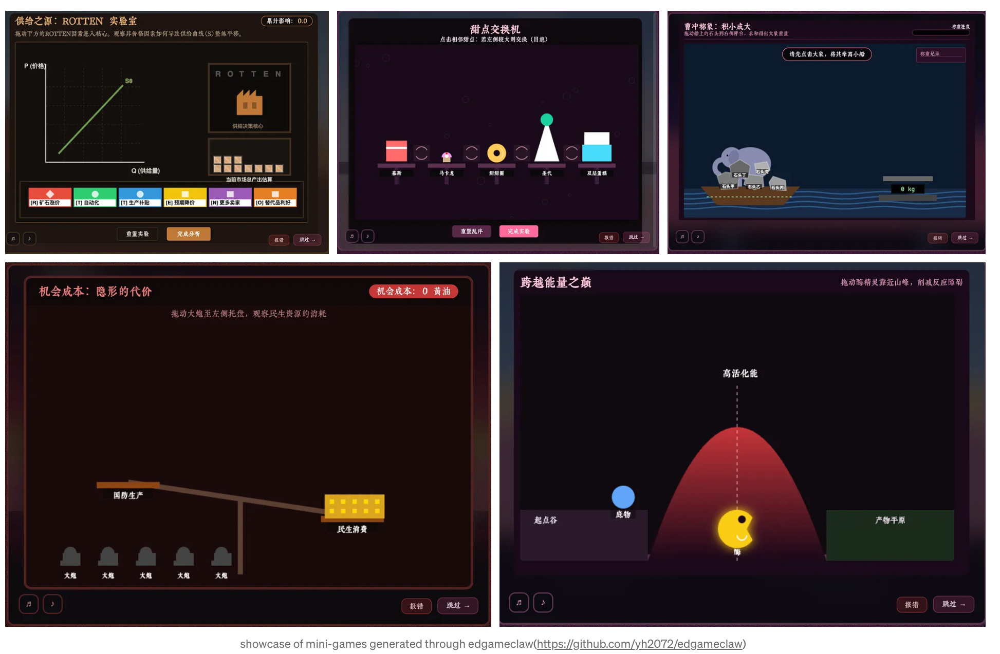

<p align="center">
  
</p>

<p align="center">
  
  
  
  
  <a href="https://pypi.org/project/edgameclaw/"></a>
  <a href="https://discord.gg/wesebXsxHV"></a>
</p>

<p align="center">
  <a href="#english"><strong>English</strong></a> &nbsp;·&nbsp;
  <a href="#简体中文"><strong>简体中文</strong></a> &nbsp;·&nbsp;
  <a href="#quick-start-zh">快速开始</a><br />
  <a href="https://ahafrog.com"><strong>ahafrog.com</strong></a> &nbsp;·&nbsp;
  <a href="https://github.com/yh2072/edgameclaw">GitHub</a> &nbsp;·&nbsp;
  <a href="https://pypi.org/project/edgameclaw/"><strong>PyPI</strong></a> &nbsp;·&nbsp;
  <a href="https://discord.gg/wesebXsxHV"><strong>Discord</strong></a> &nbsp;·&nbsp;
  <a href="https://openrouter.ai"><strong>OpenRouter</strong></a> &nbsp;·&nbsp;
  <a href="#citation">Citation</a> &nbsp;·&nbsp;
  <a href="#quick-start">Quick Start</a>
</p>

---

<a id="english"></a>

# EdGameClaw — AI Game-Based Learning Studio

> **Turn any learning material into playable mini-games — in minutes.**

<p align="center">
  <a href="https://www.producthunt.com/products/edgameclaw?embed=true&amp;utm_source=badge-featured&amp;utm_medium=badge&amp;utm_campaign=badge-edgameclaw" target="_blank" rel="noopener noreferrer">
    
  </a>
</p>

**What is this?** A small **self-hosted** app on your computer: paste notes or a textbook chapter, and AI turns them into **playable browser games** (pixel art, scoring, different mechanics per topic). **No account.** **No vendor lock-in.** Your courses stay as files on your machine.

---

## 🚀 Installation & quick start {#quick-start}

### Prerequisites

| Requirement | Notes |
|-------------|--------|
| **Python 3.10+** | Check with `python --version` or `python3 --version` (either name is fine — see below). |
| **Node.js 18+** | Must be on your `PATH` (`node --version`). Used for the bundled game engine helper. |
| **API key** | Any [OpenAI-compatible](https://openrouter.ai) provider; [OpenRouter](https://openrouter.ai) is a practical default. |
| **Conda** *(optional)* | If you prefer Conda over `venv`, see [Conda](#conda-instead-of-venv) below — same steps afterward. |

**`python` vs `python3`:** You can use **either**; they are just different command names on disk. What matters is that the interpreter is **Python 3.10+**. On **Windows** and inside **Conda**, `python` is usually correct. On some **macOS/Linux** setups, only `python3` is installed (or `python` still points to Python 2). If a command fails, try the other name. The examples below use **`python`** — swap in **`python3`** when that is what your system provides.

### Important: where `.env` and data live

- **`API_KEY`** (and optional `MODEL`, `API_BASE_URL`) are read from a **`.env` file in the current working directory** when you start the server, or from the repo / package directory when developing from a git clone. You only need **`API_KEY=...`** in `.env`; the server and generator use the same names (legacy aliases like `OPENROUTER_API_KEY` still work).
- **Generated courses** are stored under `courses/` next to that project directory. If you use `pip install` without cloning, set **`EDGAMECLAW_HOME`** to a fixed folder, or always start `uvicorn` from the same directory so you do not “lose” courses. See [Configuration](#configuration).

### Path A — Install from PyPI (fastest)

Use this when you only want to run the app, not edit the source.

1. **Create and activate a virtual environment** (recommended):

   ```bash
   python -m venv .venv
   ```

   - **macOS / Linux:** `source .venv/bin/activate`
   - **Windows (cmd):** `.venv\Scripts\activate.bat`
   - **Windows (PowerShell):** `.venv\Scripts\Activate.ps1`

2. **Install the package**

   ```bash
   pip install -U pip
   pip install edgameclaw
   ```

3. **Choose a project folder** where you will always run the server (this folder will hold `.env`, `courses/`, etc.). `cd` into it.

4. **Create `.env`** in that folder with at least:

   ```bash
   API_KEY=sk-your-key-here
   ```

   Optional: `MODEL=...` and `API_BASE_URL=...` (defaults work with OpenRouter).

5. **Start the server** (from the same folder as `.env`):

   ```bash
   uvicorn edgameclaw.server:app --host 127.0.0.1 --port 8000
   ```

6. **Open the Studio:** [http://127.0.0.1:8000/studio](http://127.0.0.1:8000/studio) (or [http://127.0.0.1:8000/](http://127.0.0.1:8000/) — it redirects to the app). Paste Markdown, parse, then generate.

If `.env` has **`API_KEY`**, you can leave the API key field empty in the Studio; otherwise paste your key there (stored in the browser only).

### Conda instead of `venv` {#conda-instead-of-venv}

EdGameClaw is installed with **pip** (PyPI). Conda gives you an isolated Python; you still use **pip inside that env** to install the app.

1. **Install [Miniconda](https://docs.conda.io/en/latest/miniconda.html)**, [Anaconda](https://www.anaconda.com/download), or [Mambaforge](https://github.com/conda-forge/miniforge#mambaforge) if you do not already have `conda`.

2. **Create and activate an environment** (Python 3.10–3.12 are fine):

   ```bash
   conda create -n edgameclaw python=3.12 -y
   conda activate edgameclaw
   ```

   Optional: use the **conda-forge** channel for the Python build:

   ```bash
   conda create -n edgameclaw -c conda-forge python=3.12 -y
   conda activate edgameclaw
   ```

   If you use **[micromamba](https://mamba.readthedocs.io/)** or **mamba**, the same commands work with `mamba create ...` / `mamba activate ...` (often faster).

3. **Install EdGameClaw** — pick one:

   - **From PyPI** (same as Path A step 2):

     ```bash
     pip install -U pip
     pip install edgameclaw
     ```

   - **From source** (after `git clone` and `cd` into the repo):

     ```bash
     pip install -U pip
     pip install -e .
     ```

4. Continue with **Path A** from step 3 (project folder, `.env`, `uvicorn`) or **Path B** from step 3 (`cp .env.example .env`, then start the server).

**`start.sh` and Conda:** `start.sh` prefers `.venv/bin/uvicorn` when that file exists. If you only use Conda, either run **`uvicorn edgameclaw.server:app --host 127.0.0.1 --port 8000`** yourself after `conda activate`, or run **`python -m uvicorn edgameclaw.server:app --host 127.0.0.1 --port 8000`** so the correct interpreter is used without relying on `start.sh`.

### Path B — Install from source (git clone)

Use this to contribute, patch prompts, or use `start.sh` on macOS/Linux.

1. **Clone and enter the repo**

   ```bash
   git clone https://github.com/yh2072/edgameclaw.git
   cd edgameclaw
   ```

2. **Virtual environment + editable install**

   ```bash
   python -m venv .venv
   source .venv/bin/activate          # Windows: .venv\Scripts\activate
   pip install -U pip
   pip install -e .
   ```

3. **Environment file**

   ```bash
   cp .env.example .env
   ```

   Edit `.env` and set **`API_KEY`**.

4. **Start the server** — pick one:

   - **macOS / Linux:** `bash start.sh` — sets `PYTHONPATH`, starts the Node helper on port **3100** if needed, then runs Uvicorn. Stop with `Ctrl+C`.
   - **Any OS:** same as PyPI — from the repo root:

     ```bash
     uvicorn edgameclaw.server:app --host 127.0.0.1 --port 8000
     ```

     The Python app will try to **auto-start** the bundled Node engine on **3100** when that port is free. If you run Node yourself, set `EDGAMECLAW_ENGINE_STATE_AUTO=0` in `.env`.

5. Open [http://127.0.0.1:8000/studio](http://127.0.0.1:8000/studio).

### Docker

There is no official image in this repo. If you build or use a community image, expose port **8000**, pass **`API_KEY`** (and optionally **`EDGAMECLAW_HOME`** as a volume for persistence), and ensure **Node** is available inside the container if you disable auto-start.

### Troubleshooting

| Problem | What to do |
|---------|------------|
| **`uvicorn` not found** | Activate your **venv** or **`conda activate edgameclaw`**, or run `python -m uvicorn edgameclaw.server:app --host 127.0.0.1 --port 8000`. |
| **Node / engine / port 3100** | Install Node 18+ from [nodejs.org](https://nodejs.org). Free port 3100 or set `ENGINE_STATE_URL` / `EDGAMECLAW_ENGINE_STATE_AUTO=0` and run `node server.js` manually under `edgameclaw/node/`. |
| **Port 8000 in use** | Stop the other process or run with `--port 8001` (and open that port in the browser). |
| **Generation says missing API key** | Put **`API_KEY`** in `.env` in the directory from which you started Uvicorn, or paste the key in the Studio. |
| **Courses disappeared** | You probably started Uvicorn from a different cwd. Set **`EDGAMECLAW_HOME`** to one absolute path and always use it, or always `cd` to the same project folder before starting. |

---

## 🎬 Watch a demo

<p align="center">
  <video
    controls
    playsinline
    preload="metadata"
    muted
    poster="edgameclaw/readme/edgameclaw_logo.png"
    src="https://github.com/user-attachments/assets/d5c19a93-6f8d-4ed2-855d-d57046bcf008"
    width="100%"
    style="max-width: 920px; border-radius: 12px;"
  >
    Your browser does not support the video tag.
  </video>
</p>

*Paste content → AI builds a game-based course → Play in the browser.*

---

## 🏆 Why EdGameClaw

Most “AI learning” tools give you slides or narrated videos. Here you get **real mini-games**: retries, scores, and a mechanic chosen to fit the topic — plus **AI-generated pixel art** and **24 themes**. Everything runs **on your machine** with **any OpenAI-compatible API** you like.

| | Typical AI course tools | EdGameClaw |
|---|---|---|
| Output | Slides, video, text | **Playable browser games** |
| Learning | Mostly passive | **Active — score, fail, retry** |
| Look | Generic templates | **Pixel art per lesson** |
| Mechanics | One quiz style | **Matched to each concept** |
| Host | Often cloud-only | **Self-hosted, offline-friendly, BYOK** |

---

## 🎮 Case Study — One Sentence. One Game.

Each game below was generated from **a single sentence or short paragraph**. No manual design. No coding.

**A World in a Square Inch**


**global vs. local debate in neuroscience**


**basic economics principles**


**Convolutional Neural Networks**


> Philosophy, neuroscience, economics, deep learning — EdGameClaw adapts its game mechanics to each subject automatically.

---

## 🧩 More Generated Mini-Games



---

## 📋 Generated Course Syllabus

EdGameClaw doesn't just create games — it first generates a structured course syllabus, then maps each chapter to the right game mechanic.


---

## ⚙️ Configuration {#configuration}

**Minimum to get going:** set **`API_KEY`** (or paste it only in the Studio UI — it stays in your browser).

Copy `.env.example` to `.env` when you run from a git clone, or create `.env` yourself in the folder where you start `uvicorn`:

| Setting | Required? | What it does |
|---------|-----------|--------------|
| `API_KEY` | Yes* | Your OpenAI-compatible API key |
| `MODEL` | No | Model name (default: `google/gemini-3-flash-preview`) |
| `API_BASE_URL` | No | API base URL (default: OpenRouter) |
| `PORT` | No | Web app port (default `8000`) |
| `BIND_HOST` | No | Listen address (default `127.0.0.1`) |
| `EDGAMECLAW_HOME` | No | Where to save `courses/`, `assets/`, `jobs/`, and `courses.json` (defaults: repo root when developing from git; **current folder** when installed from pip) |
| `EDGAMECLAW_ENGINE_STATE_AUTO` | No | `1` (default) = auto-start bundled Node on port 3100 if free. `0` = you run Node yourself. |
| `ENGINE_STATE_URL` | No | URL of the engine helper (default `http://127.0.0.1:3100`) — must match the Node port. |

\*Or enter the key **only in the Studio** (browser-only, not sent to our servers).

**Suggested provider:** [**OpenRouter**](https://openrouter.ai) — one key, [many models](https://openrouter.ai/models). Default model `google/gemini-3-flash-preview` is fast and cheap for testing.

---

## How generation works

1. Paste your content (Markdown).
2. EdGameClaw reads structure (title, chapters).
3. AI writes a **syllabus** and picks a **game mechanic** per chapter.
4. AI builds each **mini-game** (pixel art + logic).
5. You **play** in the browser — no extra export step.

---

## 📁 Project layout (for contributors)

```
edgameclaw/                    # repository root
├── pyproject.toml             # Python package metadata (pip install)
├── edgameclaw/                # importable package
│   ├── server.py              # FastAPI app
│   ├── generator/             # AI course generation pipeline
│   │   ├── pipeline.py
│   │   ├── api.py
│   │   └── ...
│   ├── engine/                # Game engine (JS + HTML)
│   ├── static/                # Landing + Studio UI
│   ├── readme/                # README assets (GIFs, screenshots)
│   └── node/                  # Engine-state server (bundled; auto-started by default)
├── courses/                   # Generated courses (local storage)
├── server.py                  # optional shim: re-exports `app` for `uvicorn server:app`
├── .env.example
├── requirements.txt           # usually: editable install (`-e .`)
└── start.sh
```

---

## 🌍 Supported Languages

Generate courses in: **English, Chinese (中文), Japanese (日本語), Spanish (Español), French (Français), Korean (한국어), Arabic (العربية), German (Deutsch)**

---

## 🎨 Visual Themes

24 built-in themes:

- **Cute/Modern:** pink-cute, ocean-dream, forest-sage, candy-pop, galaxy-purple
- **Chinese:** china-porcelain, china-cinnabar, dunhuang, forbidden-red, china-landscape
- **Historical:** renaissance, baroque, nordic, victorian, mediterranean
- **Fantasy/Genre:** fairy-tale, detective, sci-fi, academy, myth

---

## 📜 License

This project is open source under the **AGPL-3.0** license. See [LICENSE-AGPL-3.0](./LICENSE-AGPL-3.0) for the full text. For commercial licensing, contact: [yh2072@nyu.edu](mailto:yh2072@nyu.edu).

---

## 🌟 Production Use

**[ahafrog](https://ahafrog.com)** is the hosted, full-featured SaaS platform built on top of EdGameClaw — with user accounts, social features, leaderboards, and a managed infrastructure. Try it if you want the full experience without self-hosting.

### 🤝 Share Your Courses with the World

Built something great with EdGameClaw? **Publish it on [ahafrog.com](https://ahafrog.com) and share it with learners everywhere.** Your course will appear in the public course library — free to play for anyone.

---

## 📖 Citation {#citation}

If you use EdGameClaw in research or a project, please cite:

```bibtex
@software{hang2026edgameclaw,
  author    = {Hang, Yuqi},
  title     = {EdGameClaw: AI Game-Based Learning Studio},
  year      = {2026},
  url       = {https://github.com/yh2072/edgameclaw},
  note      = {Open-source AI pipeline for converting learning content into interactive mini-games}
}
```

---

## 👤 Author

**Yuqi Hang** — PhD Student @ New York University

Built EdGameClaw as an open-source foundation for AI-powered game-based learning. Research interests include AI for educational games, human-computer interaction, neuroaesthetics and educational neuroscience.

- GitHub: [@yh2072](https://github.com/yh2072)
- Website: [yuqihang.net](https://yuqihang.net)
- Project: [ahafrog.com](https://ahafrog.com)
- Community: [Discord — EdGameClaw](https://discord.gg/wesebXsxHV)

---

⭐ **If this project is useful to you, please star it on GitHub!**

---

<a id="简体中文"></a>

# 简体中文说明

> **将任何学习材料转化为可玩的小游戏 — 只需几分钟。**

**这是什么？** 装在你电脑上的**自托管**小工具：粘贴笔记或教材片段，AI 会生成**可在浏览器里玩的小游戏**（像素风、计分、每个知识点不同玩法）。**不用注册账号**，**不绑定某一家云**，课程以文件形式保存在本机。

---

## 🚀 安装与快速开始 {#quick-start-zh}

### 环境要求

| 依赖 | 说明 |
|------|------|
| **Python 3.10+** | 用 `python --version` 或 `python3 --version` 确认版本（见下说明） |
| **Node.js 18+** | 需在 `PATH` 中（`node --version`）。用于内置小游戏引擎辅助服务 |
| **API 密钥** | 任意 [OpenAI 兼容](https://openrouter.ai) 服务商；新手推荐 [OpenRouter](https://openrouter.ai) |
| **Conda**（可选） | 若用 Conda 代替 `venv`，见下文 [Conda 环境](#conda-环境)；后续步骤相同。 |

**`python` 和 `python3`：** 两个都可以用，只是系统里可执行文件名不同，**关键是版本为 Python 3.10+**。**Windows**、**Conda** 环境里一般用 `python`。部分 **macOS/Linux** 只装了 `python3`，或 `python` 仍指向 Python 2，此时请用 `python3`。下文命令统一写 **`python`**，若报错请改成 **`python3`**。

### 务必弄清：`.env` 和数据放哪

- 启动服务时，程序会在**当前工作目录**、以及（从 git 克隆时）仓库根目录等位置查找 **`.env`**。最少配置一行 **`API_KEY=你的密钥`** 即可；网页端与后台生成流水线使用同一套变量名（仍兼容旧的 `OPENROUTER_API_KEY` 等别名）。
- 生成的课程在 **`courses/`** 目录下，位置相对于「你固定使用的项目目录」。若只用 **`pip install`** 且经常换文件夹启动，课程会好像「不见了」——请固定在一个目录里启动，或设置环境变量 **`EDGAMECLAW_HOME`** 指向固定绝对路径。详见下文 [配置说明](#配置说明)。

### 方式 A — 从 PyPI 安装（最快）

适合只使用、不改源码。

1. **创建并激活虚拟环境**（推荐）：

   ```bash
   python -m venv .venv
   ```

   - **macOS / Linux：** `source .venv/bin/activate`
   - **Windows（cmd）：** `.venv\Scripts\activate.bat`
   - **Windows（PowerShell）：** `.venv\Scripts\Activate.ps1`

2. **安装包**

   ```bash
   pip install -U pip
   pip install edgameclaw
   ```

3. **选定一个「项目目录」**，以后每次都在此目录下启动（这里会放 `.env`、`courses/` 等）。`cd` 进去。

4. **在该目录新建 `.env`**，至少包含：

   ```bash
   API_KEY=你的密钥
   ```

   可选：`MODEL`、`API_BASE_URL`（默认已对接 OpenRouter 风格接口）。

5. **在同一目录启动服务**：

   ```bash
   uvicorn edgameclaw.server:app --host 127.0.0.1 --port 8000
   ```

6. 浏览器打开 **[http://127.0.0.1:8000/studio](http://127.0.0.1:8000/studio)**（根路径 [http://127.0.0.1:8000/](http://127.0.0.1:8000/) 会跳转）。粘贴 Markdown → 解析 → 生成游戏。

若 `.env` 里已配置 **`API_KEY`**，Studio 里密钥可留空；否则在网页里粘贴（仅保存在本机浏览器）。

### Conda 环境 {#conda-环境}

EdGameClaw 通过 **pip** 安装（发布在 PyPI）。Conda 负责隔离 Python 版本；**在已激活的 Conda 环境里仍用 pip 安装本软件**。

1. **若尚未安装 Conda**，可选用 [Miniconda](https://docs.conda.io/en/latest/miniconda.html)、[Anaconda](https://www.anaconda.com/download) 或 [Mambaforge](https://github.com/conda-forge/miniforge#mambaforge)。

2. **创建并激活环境**（Python 3.10–3.12 均可）：

   ```bash
   conda create -n edgameclaw python=3.12 -y
   conda activate edgameclaw
   ```

   可选：使用 **conda-forge** 源安装 Python：

   ```bash
   conda create -n edgameclaw -c conda-forge python=3.12 -y
   conda activate edgameclaw
   ```

   若使用 **[micromamba](https://mamba.readthedocs.io/)** 或 **mamba**，将 `conda create` / `conda activate` 换成 `mamba create` / `mamba activate` 即可（通常解析更快）。

3. **安装 EdGameClaw**（二选一）：

   - **PyPI**（与「方式 A」第 2 步相同）：

     ```bash
     pip install -U pip
     pip install edgameclaw
     ```

   - **源码**（`git clone` 并 `cd` 到仓库根目录后）：

     ```bash
     pip install -U pip
     pip install -e .
     ```

4. 接下来接 **方式 A** 的第 3 步起（项目目录、`.env`、`uvicorn`），或 **方式 B** 的第 3 步起（`cp .env.example .env` 等）。

**`start.sh` 与 Conda：** 脚本会优先使用仓库里的 **`.venv/bin/uvicorn`**。若你只用 Conda、未建 `.venv`，请在 `conda activate` 后直接执行 **`uvicorn edgameclaw.server:app --host 127.0.0.1 --port 8000`**，或 **`python -m uvicorn edgameclaw.server:app --host 127.0.0.1 --port 8000`**，确保用到当前环境中的解释器。

### 方式 B — 从源码安装（git 克隆）

适合改代码、改提示词，或在 macOS/Linux 下用 **`start.sh`**。

1. **克隆并进入仓库**

   ```bash
   git clone https://github.com/yh2072/edgameclaw.git
   cd edgameclaw
   ```

2. **虚拟环境 + 可编辑安装**

   ```bash
   python -m venv .venv
   source .venv/bin/activate          # Windows：.venv\Scripts\activate
   pip install -U pip
   pip install -e .
   ```

3. **复制环境变量模板并填写密钥**

   ```bash
   cp .env.example .env
   ```

   编辑 `.env`，设置 **`API_KEY`**。

4. **启动服务**（二选一）：

   - **macOS / Linux：** `bash start.sh` —— 配置 `PYTHONPATH`，必要时在 **3100** 端口启动 Node，再启动 Uvicorn；用 `Ctrl+C` 结束。
   - **任意系统：** 在仓库根目录执行：

     ```bash
     uvicorn edgameclaw.server:app --host 127.0.0.1 --port 8000
     ```

     Python 服务会在 **3100** 空闲时尝试**自动启动**自带 Node。若你自行运行 Node，在 `.env` 中设置 `EDGAMECLAW_ENGINE_STATE_AUTO=0`。

5. 打开 [http://127.0.0.1:8000/studio](http://127.0.0.1:8000/studio)。

### Docker

本仓库**不提供**官方镜像。若使用自建或社区镜像，需映射 **8000** 端口，传入 **`API_KEY`**，并用卷挂载 **`EDGAMECLAW_HOME`**（或等价路径）以持久化课程；若关闭自动启动 Node，容器内需能运行 **Node**。

### 常见问题

| 现象 | 处理 |
|------|------|
| **`uvicorn` 找不到** | 先激活 **venv**（`source .venv/bin/activate`）或 **Conda**（`conda activate edgameclaw`），或执行 `python -m uvicorn edgameclaw.server:app --host 127.0.0.1 --port 8000` |
| **Node / 3100 端口** | 从 [nodejs.org](https://nodejs.org) 安装 Node 18+；释放 3100，或修改 `ENGINE_STATE_URL` / 设置 `EDGAMECLAW_ENGINE_STATE_AUTO=0` 后手动在 `edgameclaw/node/` 下执行 `node server.js` |
| **8000 被占用** | 结束占用进程，或改用 `--port 8001` 并在浏览器访问对应端口 |
| **提示没有 API 密钥** | 在启动 Uvicorn 时的当前目录放置含 **`API_KEY`** 的 `.env`，或在 Studio 中粘贴密钥 |
| **课程列表空了** | 多半换了启动时的当前目录；请固定目录或设置 **`EDGAMECLAW_HOME`** |

---

## 🎬 演示视频

<p align="center">
  <video
    controls
    playsinline
    preload="metadata"
    muted
    poster="edgameclaw/readme/edgameclaw_logo.png"
    src="https://github.com/user-attachments/assets/d5c19a93-6f8d-4ed2-855d-d57046bcf008"
    width="100%"
    style="max-width: 920px; border-radius: 12px;"
  >
    您的浏览器不支持 video 标签。
  </video>
</p>

*粘贴内容 → AI 生成课程 → 浏览器里开玩。*

---

## 一句话看懂 EdGameClaw

多数「AI 学习」只会出幻灯片或配音视频。这里是**真正能玩的迷你游戏**：重试、得分、按知识点选机制，还有 **AI 像素画** 和 **24 套主题**。数据在你自己电脑上，**任意 OpenAI 兼容 API** 都能接。

| | 常见 AI 课工具 | EdGameClaw |
|---|---|---|
| 输出 | 幻灯片、视频、文字 | **浏览器里可玩的游戏** |
| 学习 | 偏被动 | **主动玩 — 得分、失败、重试** |
| 画面 | 模板感 | **每课独立像素风** |
| 机制 | 一种测验 | **按知识点换玩法** |
| 部署 | 常依赖云 | **自托管、可离线、自带密钥（BYOK）** |

---

## 🎮 案例展示 — 一句话，一个游戏

以下每个游戏都由**一句话或一小段文字**生成，无需手动设计，无需编程。

**方寸乾坤**


**神经科学：全局 vs 局部**


**经济学原理**


**卷积神经网络**


> 哲学、神经科学、经济学、深度学习 — EdGameClaw 会自动为每个学科匹配最合适的游戏机制。

---

## 🧩 更多生成小游戏展示


---

## 📋 自动生成的课程大纲

EdGameClaw 不只是生成游戏 — 它会先生成结构化的课程大纲，再将每个章节映射到对应的游戏机制。


---

## ⚙️ 配置说明 {#配置说明}

**最少要配：** **`API_KEY`**（或只在 Studio 网页里粘贴，密钥只留在浏览器）。

从 git 克隆时，把 `.env.example` 复制成 `.env`；只用 pip 时，在运行 `uvicorn` 的目录下自己建 `.env`：

| 变量 | 必填？ | 说明 |
|------|--------|------|
| `API_KEY` | 是* | OpenAI 兼容的 API 密钥 |
| `MODEL` | 否 | 模型名（默认 `google/gemini-3-flash-preview`） |
| `API_BASE_URL` | 否 | API 地址（默认 OpenRouter） |
| `PORT` | 否 | 网页端口（默认 `8000`） |
| `BIND_HOST` | 否 | 监听地址（默认 `127.0.0.1`） |
| `EDGAMECLAW_HOME` | 否 | 存放课程与数据的目录（git 开发时默认仓库根；pip 安装时默认**当前目录**） |
| `EDGAMECLAW_ENGINE_STATE_AUTO` | 否 | `1`（默认）= 3100 空闲时自动起内置 Node；`0` = 自己起 Node |
| `ENGINE_STATE_URL` | 否 | 引擎辅助服务地址（默认 `http://127.0.0.1:3100`） |

\*也可仅在 Studio 里输入密钥。

**推荐接入：** [**OpenRouter**](https://openrouter.ai) — 一把密钥，[多模型](https://openrouter.ai/models)。默认模型适合试玩。

---

## 生成流程（五步）

1. 粘贴 Markdown 内容  
2. 解析课程结构  
3. AI 写大纲并匹配每章游戏机制  
4. AI 生成各章小游戏  
5. 浏览器里直接玩  

---

## 📁 项目结构（给开发者）

```
edgameclaw/                    # 仓库根目录
├── pyproject.toml             # Python 包元数据（pip install）
├── edgameclaw/                # 可导入的包
│   ├── server.py              # FastAPI 应用
│   ├── generator/             # AI 课程生成流水线
│   ├── engine/                # 游戏引擎（JS + HTML）
│   ├── static/                # 落地页与 Studio
│   ├── readme/                # README 配图资源
│   └── node/                  # 引擎状态服务（默认随 uvicorn 自动启动）
├── courses/                   # 生成的课程（本地存储）
├── server.py                  # 可选：供 `uvicorn server:app` 转发到包内应用
├── .env.example
├── requirements.txt           # 通常为可编辑安装（`-e .`）
└── start.sh
```

---

## 🌍 支持语言

支持生成以下语言的课程：**英语、中文、日语、西班牙语、法语、韩语、阿拉伯语、德语**

---

## 🎨 视觉主题

24 种内置主题：

- **可爱/现代：** pink-cute、ocean-dream、forest-sage、candy-pop、galaxy-purple
- **中国风：** china-porcelain、china-cinnabar、dunhuang、forbidden-red、china-landscape
- **历史风：** renaissance、baroque、nordic、victorian、mediterranean
- **幻想/类型：** fairy-tale、detective、sci-fi、academy、myth

---

## 📜 许可证

本项目基于 [AGPL-3.0](./LICENSE-AGPL-3.0) 协议开源。商业授权合作请联系：[yh2072@nyu.edu](mailto:yh2072@nyu.edu)。

---

## 🌟 生产环境使用

**[ahafrog.com](https://ahafrog.com)** 是基于 EdGameClaw 构建的托管 SaaS 平台，提供用户账号、社交功能、排行榜和托管基础设施。如需完整体验而无需自托管，欢迎试用。

### 🤝 欢迎贡献课程、与大家一起分享

用 EdGameClaw 生成了有趣的课程？**欢迎来 [ahafrog.com](https://ahafrog.com) 发布并与全球学习者共享。** 你的课程将出现在公共课程库中，供任何人免费游玩。无论是中学物理、大学数学、编程入门还是历史人文——每一门好课都值得被更多人看到。

---

## 📖 引用

如果你在研究或项目中使用了 EdGameClaw，请引用：

```bibtex
@software{hang2026edgameclaw,
  author    = {Hang, Yuqi},
  title     = {EdGameClaw: AI Game-Based Learning Studio},
  year      = {2026},
  url       = {https://github.com/yh2072/edgameclaw},
  note      = {Open-source AI pipeline for converting learning content into interactive mini-games}
}
```

---

## 👤 作者

**Hang Yuqi（杭雨琪）** — 纽约大学博士生

EdGameClaw 是 AI 驱动游戏化学习的开源基础框架。  
研究方向包括教育游戏 AI、人机交互、神经美学与教育神经科学。

- GitHub: [@yh2072](https://github.com/yh2072)
- 个人网站：[yuqihang.net](https://yuqihang.net)
- 官网：[ahafrog.com](https://ahafrog.com)
- 社区：[Discord — EdGameClaw](https://discord.gg/wesebXsxHV)

**微信交流群：** 使用微信扫描下方二维码加入「edgameclaw 交流」群。微信群二维码会定期失效；若无法扫码加入，请开 [GitHub Issue](https://github.com/yh2072/edgameclaw/issues) 或通过上方联系方式告知，我们会更新图片。

<p align="center">
  
</p>

---

⭐ **若对你有帮助欢迎点个 Star！**

---

## Star History

<a href="https://www.star-history.com/?repos=yh2072%2Fedgameclaw&type=date&legend=top-left">
 <picture>
   <source media="(prefers-color-scheme: dark)" srcset="https://api.star-history.com/image?repos=yh2072/edgameclaw&type=date&theme=dark&legend=top-left" />
   <source media="(prefers-color-scheme: light)" srcset="https://api.star-history.com/image?repos=yh2072/edgameclaw&type=date&legend=top-left" />
   
 </picture>
</a>

**Interactive chart (opens in new tab):** [Star History](https://www.star-history.com/?repos=yh2072%2Fedgameclaw&type=date&legend=top-left) · **可交互图表（新标签打开）**：[Star History](https://www.star-history.com/?repos=yh2072%2Fedgameclaw&type=date&legend=top-left)
